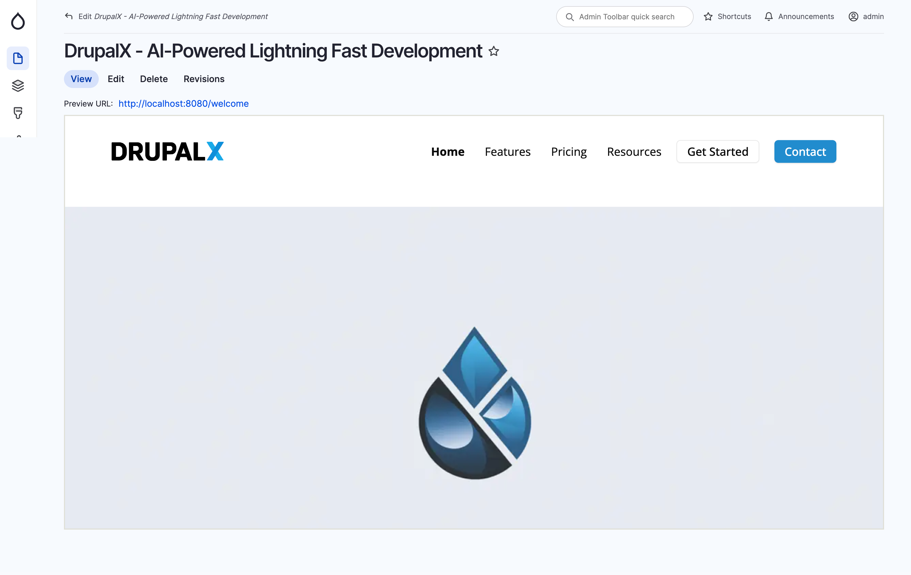

# Overview

DrupalX CMS supercharges your Drupal development with its revolutionary AI-powered toolset and lightning-fast workflow. Developers can slash development time by leveraging its intelligent code completion, automated testing, and predictive component generation. The platform ships with cutting-edge AI capabilities that transform how you build - from smart content analysis to automated accessibility improvements.&#x20;

Beyond its powerful AI features, DrupalX accelerates website creation through an extensive library of pre-built components, customizable templates, and an intuitive interface for content management and theme customization. This next-generation CMS combines the reliability of Drupal with breakthrough AI technology to help development teams build better websites in a fraction of the time.

This GitBook provides comprehensive documentation on how to install DrupalX CMS, manage content, and customize themes. Whether you're a new user or an experienced Drupal developer, you'll find everything you need to get started with DrupalX in this guide.

<figure><figcaption>
DrupalX CMS screenshot
</figcaption></figure>

