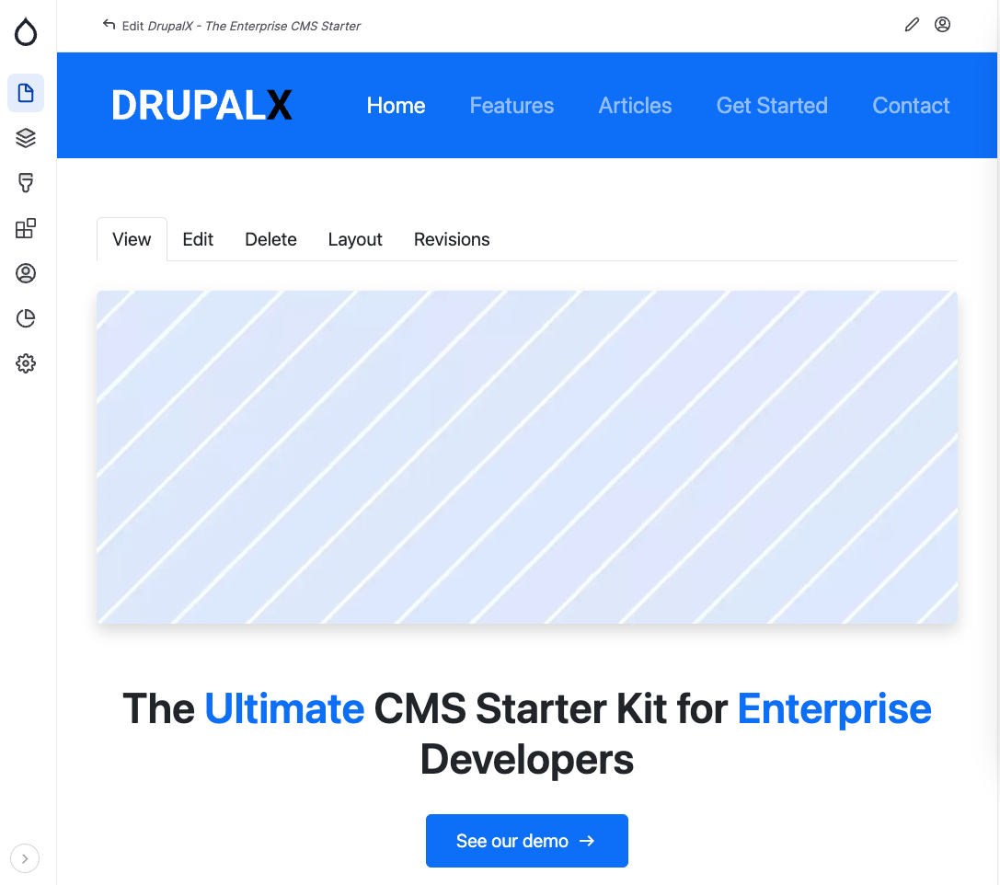

# Overview

DrupalX CMS is a powerful tool that helps you build fast, consistent, and engaging Drupal websites. It accelerates the website creation process by offering pre-built components and templates, along with a user-friendly interface for managing content and customizing themes.

This GitBook provides comprehensive documentation on how to install DrupalX CMS, manage content, and customize themes. Whether you're a new user or an experienced Drupal developer, you'll find everything you need to get started with DrupalX in this guide.

<figure><figcaption>
DrupalX Homepage Demo Screenshot
</figcaption></figure>
