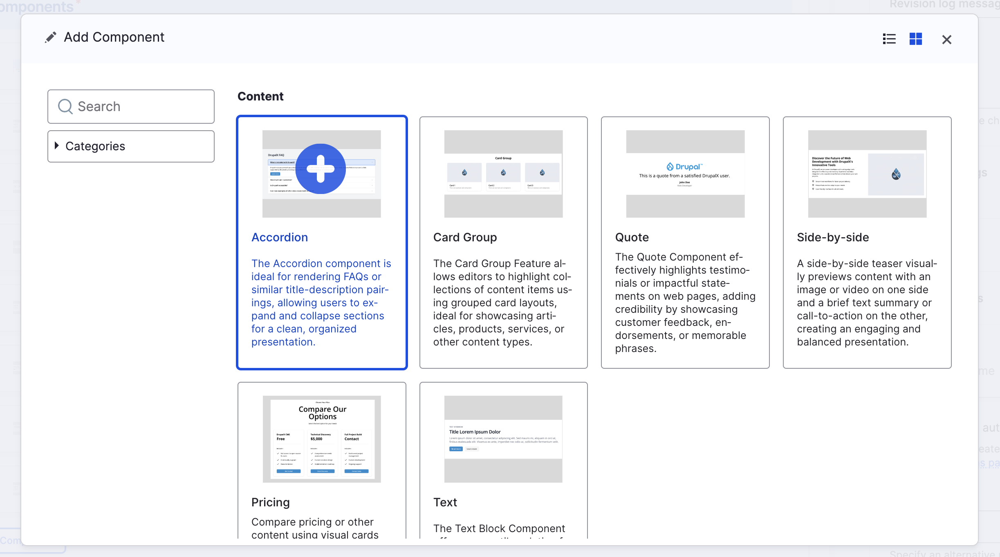

# Building with Paragraphs

The **DrupalX starter** is designed to provide robust configuration for building pages using the Drupal paragraphs on the "Landing" content type. DrupalX integrates with several additional contributed modules to enhance the editor's experience.

<figure><figcaption>
DrupalX Paragraphs picker
</figcaption></figure>

### **Key Features**

* **Enhanced Editor Experience**: Integrates with the [Paragraphs Editor Enhancements](https://www.drupal.org/project/paragraphs_ee) module, which offers a user-friendly interface with thumbnail previews. This allows editors to easily select and add components to their pages.

### **Common Web Components**

DrupalX includes a variety of common web components. These components serve as building blocks for creating dynamic and responsive web pages. As with any element in Drupal, these paragraph types are fully customizable to meet specific project requirements.
