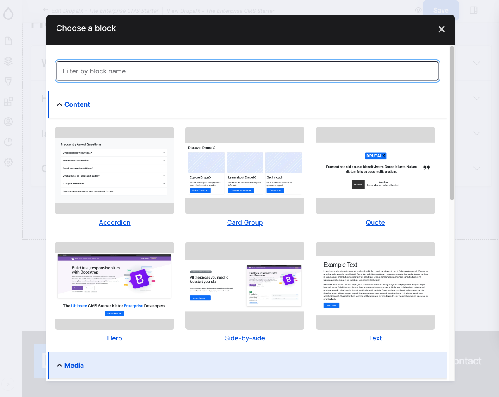

# Layout Builder

The **DrupalX install profile** is designed to provide robust configuration for building pages using the Drupal Layout Builder. It integrates with several contributed modules to enhance the editor's experience.

<figure><figcaption>
DrupalX Layout builder screenshot
</figcaption></figure>

### **Key Features**

* **Layout Builder Integration**: DrupalX fully supports Drupal's Layout Builder, enabling flexible page creation and customization.
* **Enhanced Editor Experience**: Integrates with the [Layout Builder Browser](https://www.drupal.org/project/layout\_builder\_browser) module, which offers a user-friendly interface with thumbnail previews. This allows editors to easily select and add components to their pages.

### **Common Web Components**

DrupalX includes a variety of common web components, including popular Bootstrap components. These components serve as building blocks for creating dynamic and responsive web pages. As with any element in Drupal, these block types are fully customizable to meet specific project requirements.
